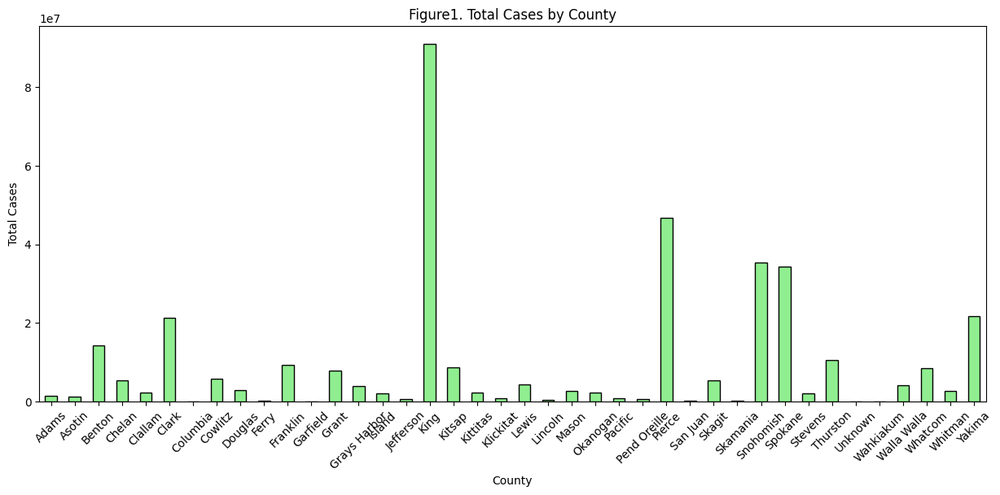
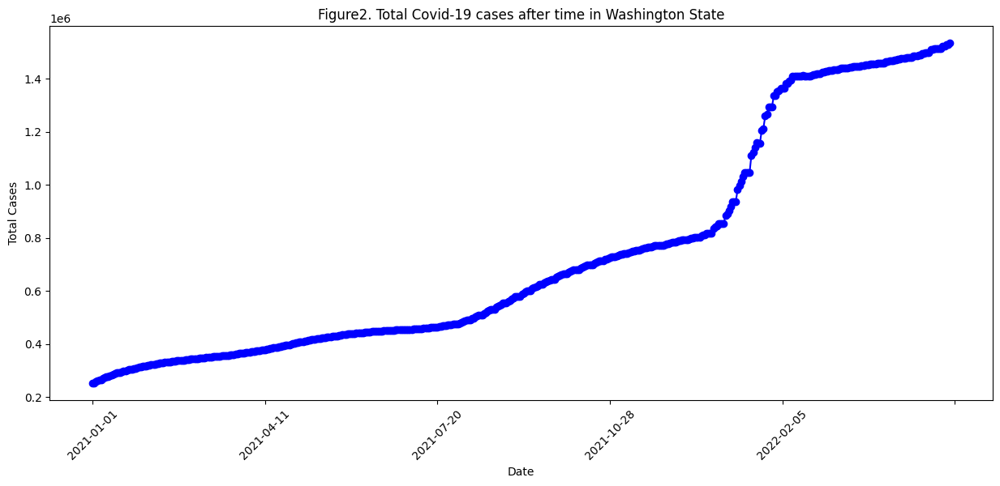

# Covid-19 Data Visualization

## Author
Hazel Zhou

## Date
May 28, 2024

## Overview
This project provides a comprehensive visualization of Covid-19 data for Washington State, focusing on data after May 28, 2020. The visualizations include data tables, bar charts, and line plots to help understand the distribution and trend of Covid-19 cases over time.

## Data Source
The data used in this project is sourced from The New York Times, based on reports from state and local health agencies. The dataset can be found at:
https://raw.githubusercontent.com/nytimes/covid-19-data/master/us-counties.csv

## Visualizations Included
1. **Data Table**: Displays the first 10 rows of the Covid-19 data for Washington State without the 'fips' column and index.
2. **Bar Chart**: Shows the total number of Covid-19 cases in each county within Washington State.
3. **Line Plot**: Illustrates the trend of Covid-19 cases over time in Washington State.

## Files
- `covid_visualization.py`: The main Python script containing the data loading, cleaning, and visualization code.
- `README.md`: This file, providing an overview and instructions for the project.

## Requirements
- Python 3.x
- pandas
- matplotlib

You can install the required Python packages using the following command:
pip install pandas matplotlib
or pip3 install pandas matplotlib

## Usage
To run the visualizations, execute the covid_visualization.py script. This script will:

1.	Load the Covid-19 data from the specified URL.
2.	Filter the data to include only entries from Washington State and dates after May 28, 2020.
3.	Generate and display the following visualizations:
	-	A data table of the first 10 rows.
	-	A bar chart of the total cases by county.
	-	A line plot of total cases over time.

## Detailed Description of Visualizations

1. Data Table of the First 10 Rows

This section prints a table containing the first 10 rows of the cleaned data, excluding the ‘fips’ column and index.

2. Bar Chart of the Number of Cases in Each County

This visualization shows the total number of Covid-19 cases reported in each county within Washington State. The bar chart is color-coded for clarity and includes labels for the x-axis (counties) and y-axis (total cases).

3. Line Plot of Cases vs. Time

This line plot illustrates the trend of Covid-19 cases over time in Washington State. Each data point is marked, and the plot includes labels for the x-axis (dates) and y-axis (total cases).

## Example Output
```
1. Data table of the first 10 rows without fips and index
Table1. First 10 Rows of Covid-19 Data
      date   county      state  cases  deaths
2021-01-01    Adams Washington   1627    16.0
2021-01-01   Asotin Washington    959    18.0
2021-01-01   Benton Washington  11692   164.0
2021-01-01   Chelan Washington   5156    36.0
2021-01-01  Clallam Washington    716     4.0
2021-01-01    Clark Washington  13344   146.0
2021-01-01 Columbia Washington     84     4.0
2021-01-01  Cowlitz Washington   2415    29.0
2021-01-01  Douglas Washington   2716    15.0
2021-01-01    Ferry Washington    176     2.0
--------------------------------------------------------------------------------
```
2. Bar chart of the number of cases in each county

--------------------------------------------------------------------------------
3. Line plot of cases vs time

